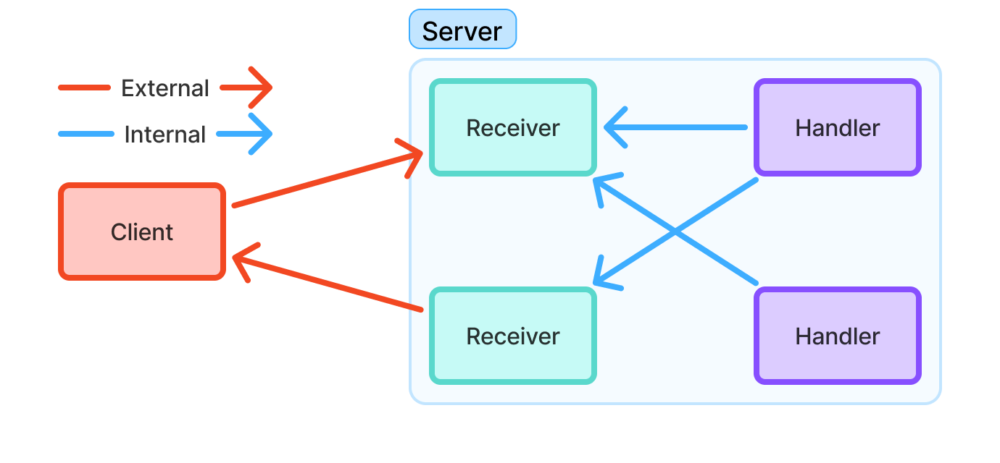

# Event Frame

Event Frame은 이벤트 전달시 사용되는 메세지 규격을 정의한 모듈입니다.

## 구조
Event Frame은 다음과 같은 구조를 가집니다.



- `Message`: 한번에 Event를 전달하는 메세지 규격입니다.
- `External Event`: 외부에 전달되는 이벤트입니다.
- `Internal Event`: 내부에 전달되는 이벤트입니다.

### Message
`Message`는 다음과 같이 구성됩니다.
```json
{
    "header": {
        "event": str // 이벤트 이름
    },
    "payload": <payload> // 이벤트 정보
}
```

## 기능
다음과 같은 기능을 제공합니다.

1. Payload
    1-1. 소개
    [class]
    1-2. Payload
    1-3. ExternalPayload
    1-4. IdPayload
    1-5. IdDataPayload
2. Event
    2-1. 소개
    [class]
    2-2. Event
    2-3. EventSet
    [func]
    2-4. set_scope
3. Message
    3-1. 소개
    [class]
    3-2. Message
---

# 1. Payload

### 1-1 소개
Event 속 세부 정보를 담는 Event의 필드입니다.

---
## class
### 1-2 Payload
`Payload`는 Payload 구현체의 베이스입니다.
`DataObj`를 상속합니다.

### 1-3 ExternalPayload
`ExternalPayload`는 `External Event`를 위한 Payload입니다.
이는 구현체의 상속하여 사용합니다.

```py
class ImplExternalPayload(ExternalPayload):
    ...
```

### 1-4 IdPayload
`IdPayload`는 `Internal Event`를 위한 Payload입니다.
이는 변경된 state를 조회 가능한 Id를 담습니다.

```py
IdPayload[str](id="ExampleId")
```

### 1-5 IdDataPayload
`IdDataPayload`는 `Interanl Event`를 위한 Payload입니다.
이는 변경된 state를 조회 가능한 Id와 변경이전 state를 담은 data를 담습니다.

```py
IdDataPayload[str, ExampleData](
    id="ExampleId",
    data=ExampleData()
)
```
--- 

# 2. Event
### 2-1 소개
Event는 EventBroker가 전달하는 주체입니다.

```py
class ExampleEventSet(EventSet):
    EVENT_1 = Event[ExamplePayload] # Payload Type 정의

# 해당 event를 받음
def some_func(event:ExampleEventSet.EVENT_1):
    event.payload # ExamplePayload
```

## class

### 2-2 Event
`Event`는 Event를 정의하기 위한 class입니다.

### 2-3 EventSet
`EventSet`은 `Event`를 정의해 묶는 class입니다.

## func

### 2-4 set_scope
`set_scope`는 `EventSet`의 scope를 설정합니다.
scope가 설정된 `EventSet`의 `Event`의 Event 이름은 `{scope_name}.{event_name}`의 형태로 변경됩니다.

```py
@set_scope("Example")
class ExampleEventSet(EventSet):
    EVENT_1 = Event[ExamplePayload]
    # 이름 변경 | EVENT_1 -> Example.EVENT_1
```
---

# 3. Message
### 3-1. 소개
Message는 EventBroker가 통신에 사용할 통신단위입니다.


## class 
### 3-2. Message
`Message`는 Message를 정의한 class입니다.

다음과 같은 Method를 가집니다.
[Method]
1. to_dict
[ClassMethod]
2. 


